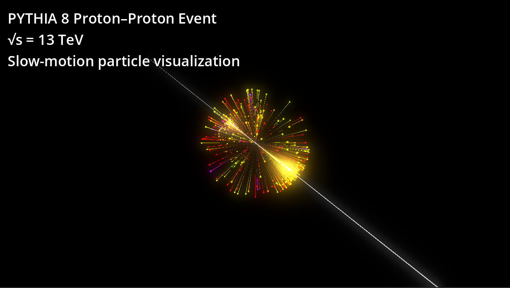

# pythia-event-visualizer
A 3D event display for visualizing particle collision events generated with 
Pythia.  
This project was built as part of my portfolio to combine interests in physics,
simulation, and interactive visualization.

## Overview
This tool reads event data exported from a particle physics generator and 
renders particle tracks in a 3D environment. It is intended as a lightweight
interactive demonstration rather than a full experimental analysis framework.

---

## Features
- 3D particle event visualization
- Animated track rendering
- Halo / trail effects for particles
- Camera controls for inspecting events
- JSON-based event input pipeline

---

## Demo

---

## Screenshot

---

## Controls

| Control | Action |
|---------|--------|
| WASD    | Move camera |
| Mouse   | Look around |
| Scroll  | Zoom |

---

## Tech Stack
- Godot
- Python
- Pythia-generated event data
- JSON for event interchange

---

## Running the Project
1. Clone the repository
2. Open the `godot_project/` folder in Godot
3. Run the main scene

## Project Motivation
I built this project to create a visually engaging bridge between particle 
physics and interactive software development.

## What am I seeing here?
This is a visualization of a proton-proton collision, where you are looking
down at the collision vertex, immediately after the protons have collided.
The beamline is depicted along the z-axis as a thick white line.
A multitude of particles fly away from the collision vertex; this shows
a sphere that represents each particle, along with a trail.  The particles are
color-coded according to particle type, with the following color scheme:
- photon: yellow
- electron/positron: green
- muon: cyan
- tau: turquoise
- neutrinos: blue
- pions: red
- kaons: orange
- baryons: magenta
- others: gray

## Future Improvements
- multiple event loading
- UI overlays for particle metadata
- camera rig polish
- collision / detector geometry overlays
- packaged executable release

## Author
Matthew Lockner  
PhD Nuclear Physics – Iowa State University